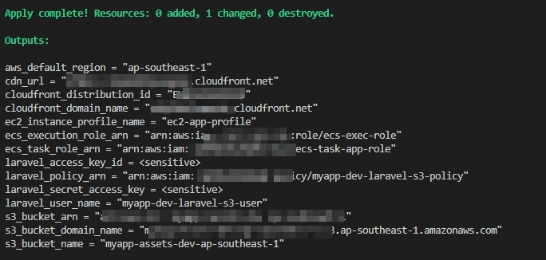

<!-- @format -->

# S3 + CloudFront CDN Terraform Configuration

Konfigurasi Terraform untuk membuat S3 bucket dengan CloudFront CDN yang aman untuk serving static assets (gambar, file, dll) dengan IAM roles untuk integrasi EC2 dan ECS.

## 🚀 Quick Start

1. **Setup**:

   ```bash
   cd s3-cloudfront
   cp terraform.tfvars.example terraform.tfvars
   # Edit terraform.tfvars sesuai kebutuhan
   ```

2. **Deploy**:

   ```bash
   # Menggunakan script
   ./deploy.sh

   # Atau manual
   terraform init
   terraform plan
   terraform apply
   ```

<p align="center">
  
</p>

## ✨ Features

- 🔒 **S3 Bucket**: Private bucket dengan encryption, versioning, dan lifecycle policies
- 🌐 **CloudFront CDN**: Global content delivery dengan Origin Access Control (OAC)
- 🔧 **CORS Support**: Konfigurasi CORS untuk web applications
- 👤 **IAM Roles**: Pre-configured roles untuk EC2 dan ECS
- 🛡️ **Security**: Public access blocked, encrypted storage
- 🌍 **Custom Domain**: Optional custom domain dengan ACM certificate

## 📋 Prerequisites

- Terraform >= 1.0
- AWS CLI configured
- AWS credentials dengan permission untuk S3, CloudFront, IAM

## ⚙️ Configuration

### Basic Configuration (terraform.tfvars)

```hcl
# Project Configuration
project = "myapp"
env     = "dev"
region  = "ap-southeast-1"

# S3 Bucket Configuration
bucket_name = "myapp-assets-dev-ap-southeast-1"

# CORS Configuration
cors_allowed_origins = [
  "https://myapp.com",
  "http://localhost:3000"
]

# CloudFront Configuration
price_class = "PriceClass_200"
```

### Custom Domain (Optional)

```hcl
# Uncomment untuk custom domain
aliases = ["cdn.myapp.com"]
acm_certificate_arn = "arn:aws:acm:us-east-1:123456789012:certificate/your-cert-id"
```

## 📤 Outputs

Setelah deployment, Anda akan mendapatkan:

- `s3_bucket_name`: Nama S3 bucket
- `cloudfront_domain_name`: Domain CloudFront
- `cdn_url`: URL CDN lengkap
- `ec2_instance_profile_name`: IAM instance profile untuk EC2
- `ecs_task_role_arn`: IAM role ARN untuk ECS tasks
- `ecs_execution_role_arn`: IAM role ARN untuk ECS execution

## 🔗 Integration Examples

### Laravel (.env)

```env
AWS_DEFAULT_REGION=ap-southeast-1
AWS_BUCKET=myapp-assets-dev-ap-southeast-1
AWS_URL=https://xxxx.cloudfront.net
AWS_USE_PATH_STYLE_ENDPOINT=false
```

### JavaScript Upload

```javascript
import { S3Client, PutObjectCommand } from "@aws-sdk/client-s3";

const s3Client = new S3Client({
  region: "ap-southeast-1",
  credentials: {
    accessKeyId: "YOUR_ACCESS_KEY",
    secretAccessKey: "YOUR_SECRET_KEY",
  },
});

const uploadFile = async (file, key) => {
  const command = new PutObjectCommand({
    Bucket: "myapp-assets-dev-ap-southeast-1",
    Key: `users/${key}`,
    Body: file,
    ContentType: file.type,
  });

  await s3Client.send(command);
  return `https://d1234567890abc.cloudfront.net/users/${key}`;
};
```

## 🛠️ Commands

```bash
# Initialize
terraform init

# Plan deployment
terraform plan

# Apply changes
terraform apply

# Show outputs
terraform output

# Destroy resources
terraform destroy

# Using Makefile
make help
make init
make plan
make apply
make destroy
```

## 🔧 Troubleshooting

### Common Issues

1. **Bucket name exists**: Ganti `bucket_name` di terraform.tfvars
2. **CORS errors**: Tambahkan domain ke `cors_allowed_origins`
3. **Permission denied**: Pastikan IAM roles terpasang dengan benar
4. **CloudFront not working**: Tunggu 15-30 menit untuk deployment

### Debug Commands

```bash
# Check S3 access
aws s3 ls s3://your-bucket-name/

# Check CloudFront status
aws cloudfront get-distribution --id E1234567890ABC

# Invalidate cache
aws cloudfront create-invalidation --distribution-id E1234567890ABC --paths "/*"
```

### env

```
### Opsi 1: Menggunakan Environment Variables (Recommended)

# Setup environment variables
make env-setup
# atau
./setup-env.sh

# Kemudian jalankan terraform
terraform plan

### Opsi 2: Menggunakan AWS CLI Configure
# Setup AWS CLI
aws configure

# Kemudian jalankan terraform
terraform plan

#Opsi 3: Manual Environment Variables
# Set environment variables
export AWS_ACCESS_KEY_ID="your key"
export AWS_SECRET_ACCESS_KEY="your secret"
export AWS_DEFAULT_REGION="ap-southeast-1"

# Kemudian jalankan terraform
terraform plan

```

## 💰 Cost Optimization

- **Price Classes**:

  - `PriceClass_100`: NA & Europe only (cheapest)
  - `PriceClass_200`: NA, Europe, Asia, ME, Africa (recommended)
  - `PriceClass_All`: All locations (most expensive)

- **Lifecycle**: Files otomatis pindah ke Intelligent Tiering setelah 30 hari

## 📚 Documentation

- [TROUBLESHOOTING.md](TROUBLESHOOTING.md) - Panduan troubleshooting
- [COST_OPTIMIZATION.md](COST_OPTIMIZATION.md) - Optimasi biaya
- [SECURITY.md](SECURITY.md) - Kebijakan keamanan
- [CONTRIBUTING.md](CONTRIBUTING.md) - Panduan kontribusi

## 🆘 Support

Jika ada masalah:

1. Cek [TROUBLESHOOTING.md](TROUBLESHOOTING.md)
2. Review [CHANGELOG.md](CHANGELOG.md)
3. Buat issue dengan detail lengkap

## 📄 License

MIT License - lihat [LICENSE](LICENSE) untuk detail.
